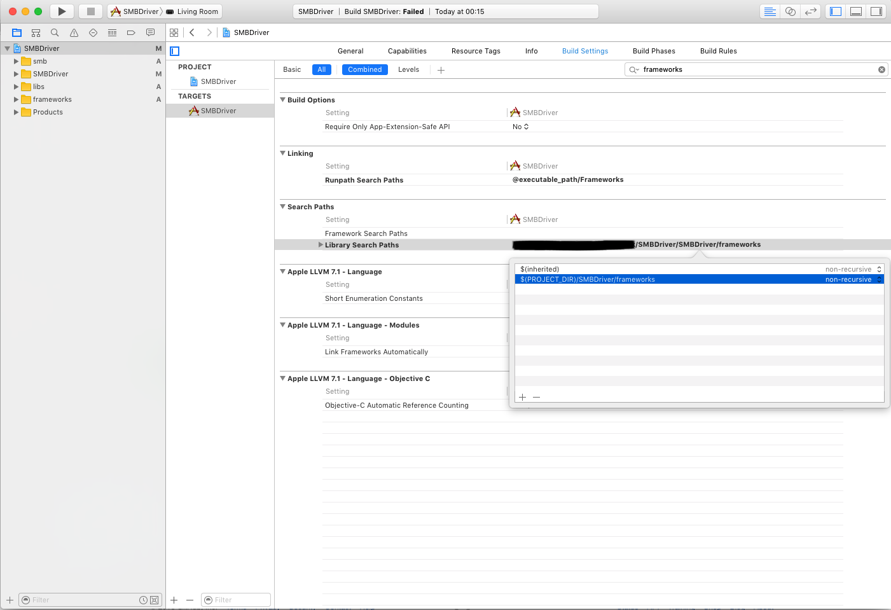
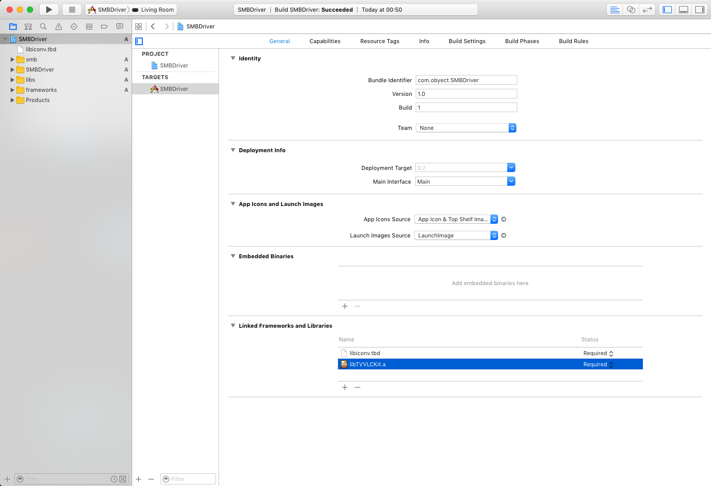
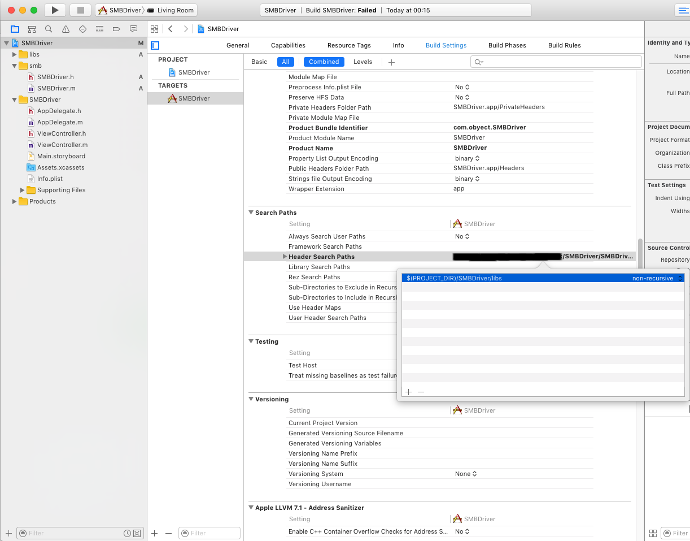

# SMBDriver


** About **
** ----- **
This project uses VideoLabs - libDSM open source project that allows SMB/XSMB/Samba C interface, and the libTASN1 GNU project,
link to the libDSM Git: https://github.com/videolabs/libdsm
link to the libTASN1 project page: https://www.gnu.org/software/libtasn1

i used TVVLCKit instead of compiling the libDSM and libTASN1 (since i use it in my projects),
link to the TVVLCKit Git: https://code.videolan.org/videolan/VLCKit

The Objective C class allows read and write text files (only text files!) of files residing on SMB / xSMB / Samba share drives.

you can compile and run on AppleTV but it should be able to adjust easelly to any other iDevice like: iPhone / iPad...

the class is equipped with test methods to test drive the actual infrastructure methods and supply a usage example to get you started faster.

code is fully documented with remarks, read them - they will help you better understand the code in case of failure or bugs.


** what is required **
** ---------------- **
in order to compile and run this project, you need the libDSM.a and libtasn1.a compiled for your running environment (device / simulator / iPhone / Apple TV ...)

In my project i use the TVVLCKit which is the VLCKit for Apple TV (although not made for these purposes, it includes both of these libs),

I use their classes VLCMedia and VLCMediaList in order to browse the network for computers / share folder and browse through those folders, and stream media files to the iDevice, the only thing i was missing is text write and read interface, and this is what this project complete (i might implement the rest of the methods over time or based on requests).


** How to Run **
** ---------- **
1. download this project
2. open the SMBDriver.xcodeproj file in xCode
3. select the active scheme and device/simulator from the available schemas
4. this project uses the TVVLCKit but you can download or compile the libDSM.a and libtasn1.a
5. in the "SMBDriver.m" class, at the "testRead" and "testWrite" methods - set your relevant values for the computer/share/user/password/file
6. run the project and it should write debug lines to the console the steps it succeeded or on what it failed
 
in your project you can execute this project from Objective-C class or from swift using the bridge header


** How to add this feature to your project **
** --------------------------------------- **
1. add the lib folder (includes the .h interfaces for the required libs), you can exclude the TVVLCKit folder if you decide not to use it
2. add the compiled or downloaded libDSM.a and libtasn1.a to your project or if you decide to use TVVLCKit then you can simply do the same with TVVLCKit.a or TVVLCKit.framework (usually under folder called "framework")
3. make sure your added "framework" folder appears in xcode project file -> target -> "Build Settings" -> "Search Paths" -> "Library Search Paths" -> add entry which includes the value: "$(PROJECT_DIR)/SMBDriver/frameworks" (replace SMBDriver with your own project name) like in the following image
 
<p align="center">
  
</p>

4. in xcode in your project's target under "General" -> "Linked Framework and Libraries" -> add the relevant ".a" or ".framework" files (ether the TVVLCKit.a or the TVVLCKit.framework or both: libDSM.a and libtasn1.a) and also add "libiconv.tbd" from the tvOS libraries, like in the following image:
 
<p align="center">
  
</p>

5. in xcode in your project's target under "Build Settings" -> "Search Paths" -> "Header Search Paths" -> add entry which includes the value: "$(PROJECT_DIR)/SMBDriver/libs" (replace SMBDriver with your own project name) like in the following image
 
<p align="center">
  
</p>

6. copy the folder "smb" and add it to your source tree
7. add the appropriate code (based on your language of choice), see the code examples, or use the test methods.


** Code Examples: **
** -------------- **

###Objective-C:

####run the test methods:
```objective-c
    
    // init the SMBDriver object
    SMBDriver * driver = [[SMBDriver alloc] init];
    
    // set debug mode to true
    driver.debug = YES;

    // execute the write test method
    [driver testWrite];
    
    // execute the test read method
    [driver testRead];
    
```

####Read a text file from an SMB share:
```objective-c

    NSString * hostName = @"MyMac";
    NSString * userName = @"test";
    NSString * loginPassword = @"1234";
    NSString * fileNameAndPath = @"/test.txt";
    NSString * sharedFolder = @"MyShare";
    NSError * error;
    NSString * fileContent;
    
    fileContent = [self readTextFileFromHost:hostName withLogin:userName withPassword:loginPassword withFileName:fileNameAndPath onShare:sharedFolder error:&error];
    
    if(fileContent != NULL)
    {
        printf("File Content:\n%s\n", [fileContent UTF8String]);
    }
    else
    {
        printf("failed to read file content, errorCode: %ld, errorMessage: %s\n", (long)error.code, [error.localizedDescription UTF8String]);
    }

```

####Write a string to text file over SMB:
```objective-c

    NSString * hostName = @"MyPC";
    NSString * userName = @"test";
    NSString * loginPassword = @"1234";
    NSString * fileNameAndPath = @"/test1.txt";
    NSString * sharedFolder = @"MyShare";
    NSString * textToWrite = @"This is my first line (1)\nthis is the second line (2)!";
    NSError * error;
    int writeResult;
    
    writeResult = [self writeTextFileFromHost:hostName withLogin:userName withPassword:loginPassword withFileName:fileNameAndPath onShare:sharedFolder textToWrite:textToWrite append:NO error:&error];
    
    if(writeResult == 0)
    {
        printf("Successfully written file");
    }
    else
    {
        printf("failed to write file content, errorCode: %ld, errorMessage: %s\n", (long)error.code, [error.localizedDescription UTF8String]);
    }
    
```


###Swift:

####run the test methods:
```swift
        
        // run the write test method
        smbDriver.testWrite()
        
        // run the read test method
        smbDriver.testRead()
        
```

####Read a text file from an SMB share:
```swift

        // variable to contain the read method returning value
        var fileContent: String = ""
        
        // init the SMBDriver
        let smbDriver: SMBDriver = SMBDriver()
        
        // set debug mode to true
        smbDriver.debug = true
        
        // set the connect data you would like to use while writing
        let hostName: String = "MyPC"
        let userName: String = "test"
        let loginPassword: String = "1234"
        let fileNameAndPath: String = "/test.txt"
        let sharedFolder: String = "MyShare"
        
        do
        {
            // write a string to a text file on SMB share, if the file does not exists (and the user has write permissions) the file will be created
            // if the file does exist - the file will be overwritten
            fileContent = try smbDriver.readTextFileFromHost(hostName, withLogin: userName, withPassword: loginPassword, withFileName: fileNameAndPath, onShare: sharedFolder)
            NSLog("Successfully read file, here is its content:\n\(fileContent)")
        }
        catch
        {
            NSLog("failed to write file content, errorCode: \((error as NSError).code), errorMessage: \((error as NSError).localizedDescription)");
        }
        
```

####Write a string to text file over SMB:
```swift
        // variable to contain the write method returning value
        var writeResult: Int32 = -1
        
        // variable to contain the returning NSError (in case error occure)
        var error: NSError?
        
        // init the SMBDriver
        let smbDriver: SMBDriver = SMBDriver()
        
        // set debug mode to true
        smbDriver.debug = true
        
        // set the connect data you would like to use while writing
        let hostName: String = "MyPC"
        let userName: String = "test"
        let loginPassword: String = "1234"
        let fileNameAndPath: String = "/test.txt"
        let sharedFolder: String = "MyShare"
        
        // set the text you would like to write to the file
        let textToWrite: String = "This is my first line (1)\nthis is the second line (2)!"
        
        // write a string to a text file on SMB share, if the file does not exists (and the user has write permissions) the file will be created
        // if the file does exist - the file will be overwritten
        writeResult = smbDriver.writeTextFileFromHost(hostName, withLogin: userName, withPassword: loginPassword, withFileName: fileNameAndPath, onShare: sharedFolder, textToWrite: textToWrite, append: false, error: &error)
        
        if(writeResult == 0)
        {
            NSLog("Successfully written file")
        }
        else
        {
            NSLog("failed to write file content, errorCode: \(error!.code), errorMessage: \(error!.localizedDescription)");
        }

```

submit requests or bug report in the issues tab.
